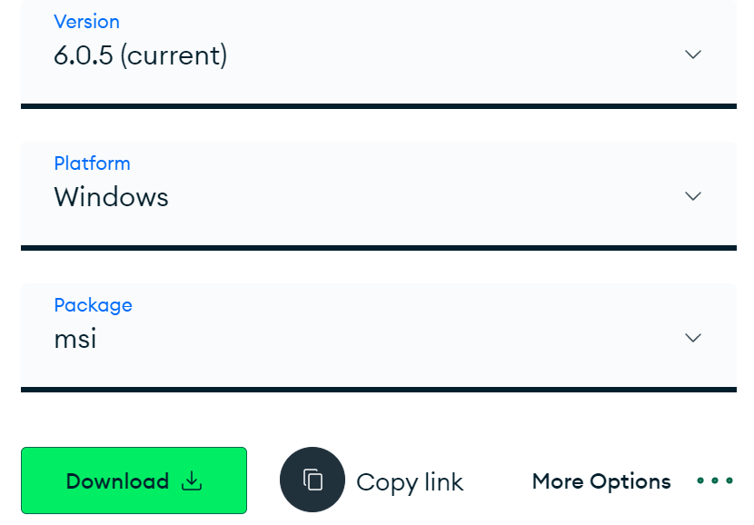
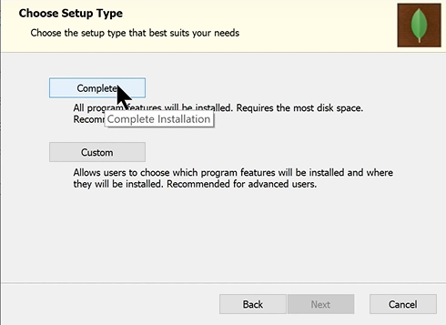
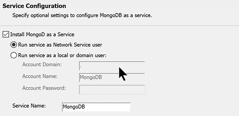
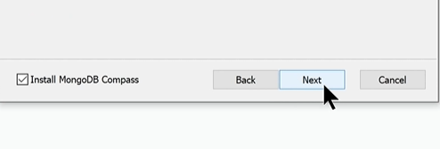
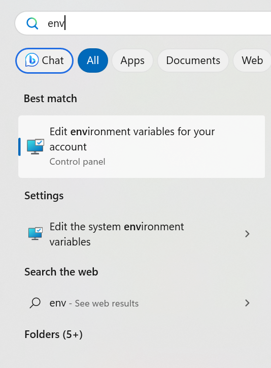
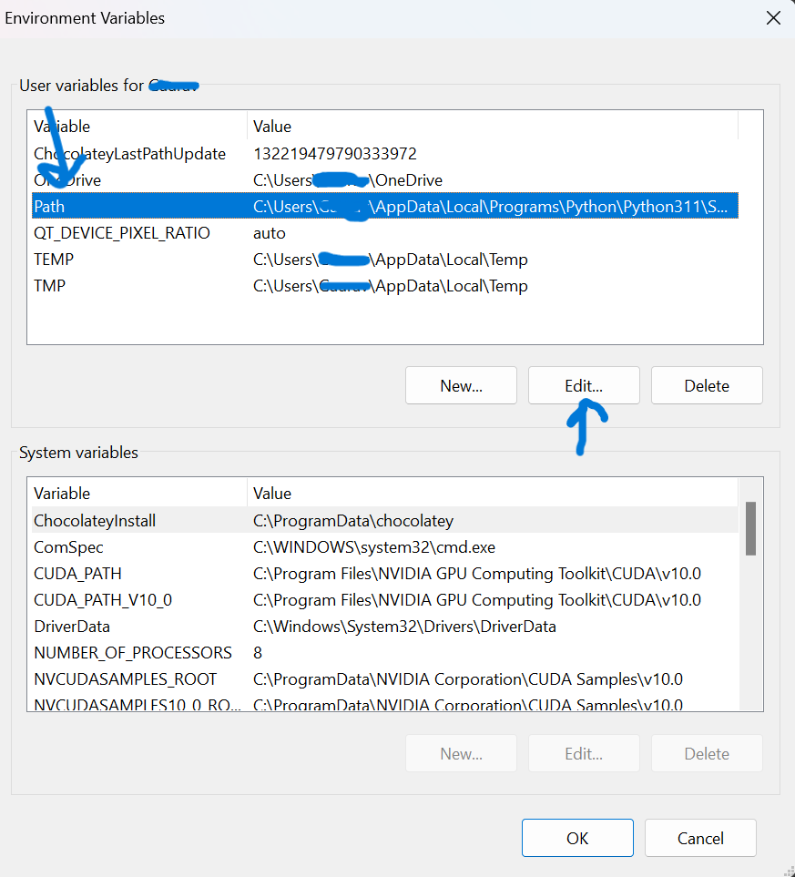
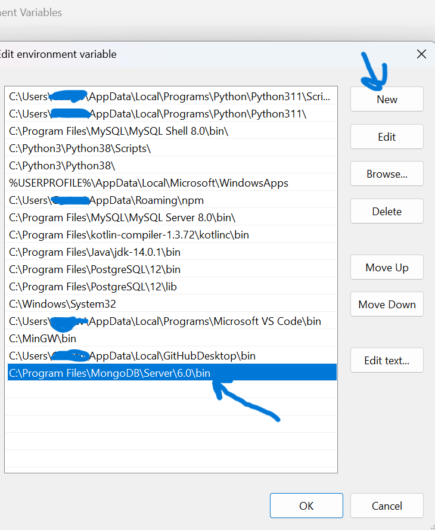
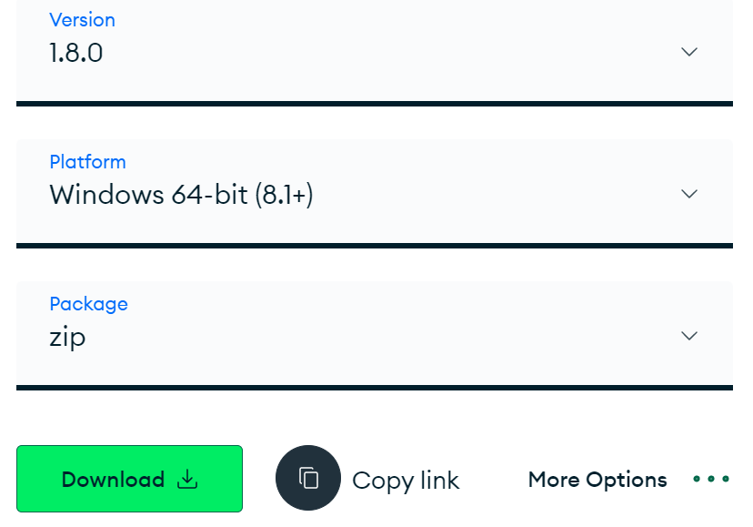
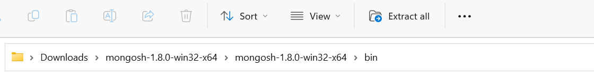

# MongoDB version 6.0.5
## Setup

**1. Install MongoDB Community version**

`visit:` https://www.mongodb.com/try/download/community

`--> Download version 6.0.5 | windows | msi`

<a href="#"></a>

`--> Install package (Complete Installation)`

<a href="#"></a>

`--> Install as a Service`

<a href="#"></a>

`--> Check "Install MongoDB compass" during setup`

<a href="#"></a>
`-------------------- After setup is Done ---------------------`

`--> Go to mongoDB installed files & copy bin location`

<a href="#"></a>

`Search "enviroment variables" in windows`

<a href="#"></a>

`Select "path" in "User variable for xxx" and press edit`

<a href="#"></a>

`click "new" and paste the copied path of bin` 

<a href="#"></a>

`press ok-ok-ok for save and exit`

**2. Setup mongosh (mongoDB shell)**

`visit:` https://www.mongodb.com/try/download/shell

`--> Download version 1.8.0 | windows 64 bit(8.1+) | zip`

<a href="#"></a>

`--> Go to downloads, unzip package & copy the following location`

<a href="#"></a>

`--> Paste the copied location at the same location where we pasted mongoDB earlier`
`i.e. enviroment variables > user variables`

<a href="#"></a>

<a href="#"></a>

## Commands in MongoDB v6.0.5

**1. MongoDB version check** 
```shell
$ mongod -version
```
**2. Login to mongosh terminal** 
```shell
$ mongosh      # activate mongoDB terminal
```
**3. Check databases** 
```shell
$ show dbs || show databases    # Show all the databases present
```

**4. Select existing or make new database**
```shell
$ use database_name
```

**5. View current selected database**
```shell
$ db
```
**6. Drop/Delete Database (delete current selected db)**
```shell
$ db.dropDatabase()
``` 
**7. Check collections in any selected database**
```shell
$ show collections
```

**8. Create new collection in any selected database**
```shell
$ db.createCollection('collection_name')
```

**9. Delete any collection from selected database**
```shell
$  db.'collection_name'.drop()
```

**10. Insert row in any collection in any selected database**
```shell
$ db.collection_name.insert({
    "name": "sample",
    "age": 22,
})
```
**11. Insert multiple row in any collection in any selected database**
```shell
$ db.collection_name.insertMany([{
    "name": "sample",
    "age": 22,
},
{
    "name": "sample 2",
    "age": 21,
    "address":"sample address goes here"
},
{
    "name": "sample 3",
    "age": 26,
    "address":"sample address goes here",
    "phone":"123456789"
}
])
```
**12. See all the inserted rows in collection**
```shell
$ db.collection_name.find()                     # display all the rows present in collection
$ db.collection_name.find().pretty()            # show all the present rows in pretty/clean way
$ db.collection_name.find().pretty().limit(num_here)    # setting max number of rows that can be displayed
$  db.content.findOne({attribute:'value'})  # It finds one match and display it. If many present it will find one and stop
```

**13. Find in collection with attribute(matching)**
```shell
$ db.collection_name.find({attribute:'value'})                          # In case of int no need to use ''
$ db.collection_name.find({attribute1:'value'}, {attribute2:'value'})   # works as 'and' operator  
```

**14. Count the number of rows found by find() function**
```shell
$ db.collection_name.find().count()     # It will print total rows present no matter what limit is set
```

**15. Sorting the data(ascending & descending order)**
```shell
$ db.collection_name.find().sort({attribute:1})     # sorts on the basis of attribute in ascending order(1)
$ db.collection_name.find().sort({attribute:-1})    # sorts on the basis of attribute in descending order(-1)
```
**16. Update a Row**
```shell
db.comments.updateOne({name: 'Shubham'},
{   'name': 'Harry',
    'lang': 'JavaScript',
    'member_since': 51
}, {upsert: true})
 # it will update the row(if available), or insert new row if no match is found
```

**17.Update Operators**
`visit:` https://www.mongodb.com/docs/manual/reference/operator/update/
