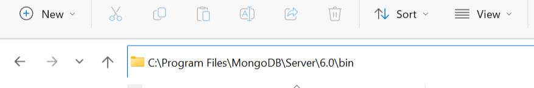

# MongoDB version 6.0.5
## Setup

**1. Install MongoDB Community version**

`visit:` https://www.mongodb.com/try/download/community

`--> Download version 6.0.5 | windows | msi`

<a href="#"></a>

`--> Install package (Complete Installation)`

<a href="#"></a>

`--> Install as a Service`

<a href="#"></a>

`--> Check "Install MongoDB compass" during setup`

<a href="#"></a>
`-------------------- After setup is Done ---------------------`

`--> Go to mongoDB installed files & copy bin location`

<a href="#"></a>

`Search "enviroment variables" in windows`

<a href="#"></a>

`Select "path" in "User variable for xxx" and press edit`

<a href="#"></a>

`click "new" and paste the copied path of bin` 

<a href="#"></a>

`press ok-ok-ok for save and exit`

**2. Setup mongosh (mongoDB shell)**

`visit:` https://www.mongodb.com/try/download/shell

`--> Download version 1.8.0 | windows 64 bit(8.1+) | zip`

<a href="#"></a>

`--> Go to downloads, unzip package & copy the following location`

<a href="#"></a>

`--> Paste the copied location at the same location where we pasted mongoDB earlier`
`i.e. enviroment variables > user variables`

<a href="#"></a>

<a href="#"></a>

## Commands in MongoDB v6.0.5

**1. MongoDB version check** 
```shell
$ mongod -version
```
**2. Login to mongosh terminal** 
```shell
$ mongosh
```
**3. Check databases** 
```shell
$ show dbs || show databases
```

**4. Select existing or make new database**
```shell
$ use database_name
```

**5. View current selected database**
```shell
$ db
```
**6. Drop/Delete Database (delete current selected db)**
```shell
$ db.dropDatabase()
``` 
**7. Check collections in any selected database**
```shell
$ show collections
```

**8. Create new collection in any selected database**
```shell
$ db.createCollection('collection_name')
```

**9. Delete any collection from selected database**
```shell
$  db.'collection_name'.drop()
```

**10. Insert data in any collection in any selected database**
```shell
db.collection_name.insert({
    "name": "sample",
    "age": 22,
})
```